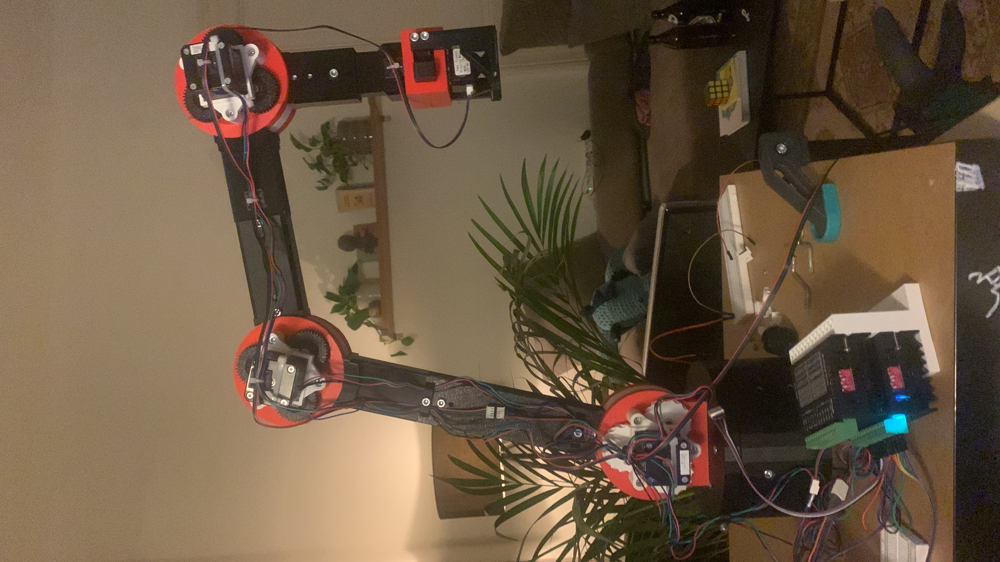
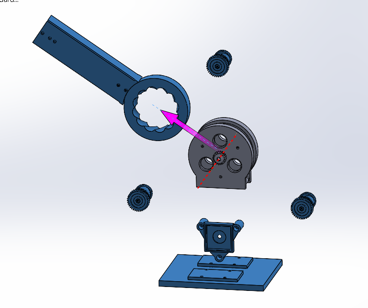
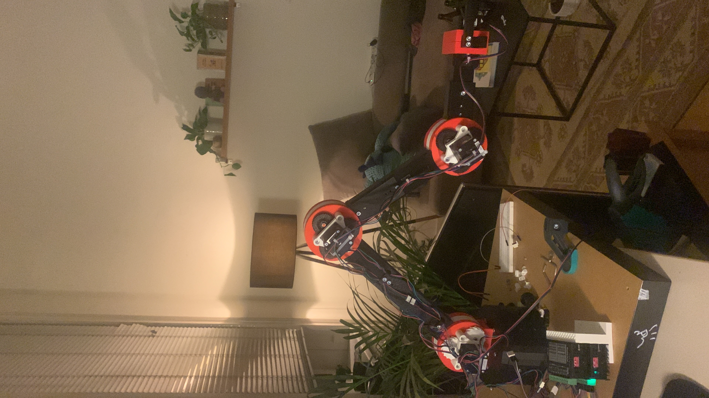
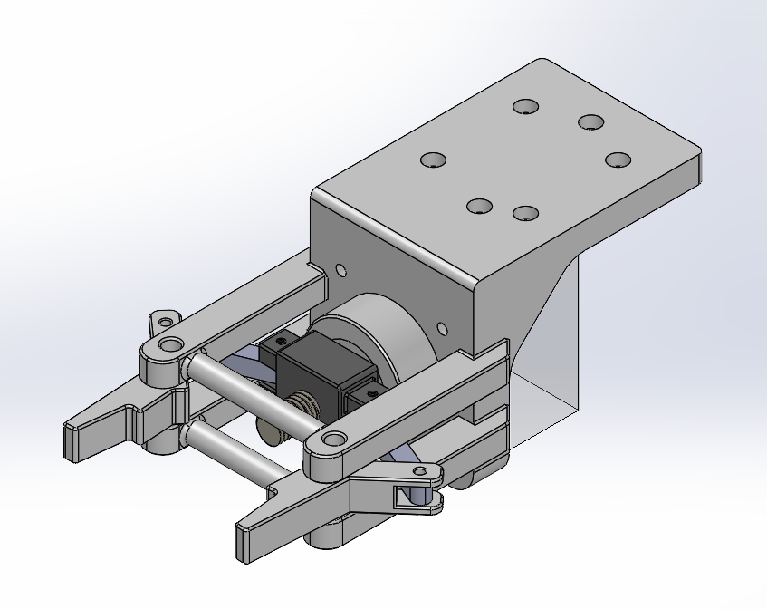
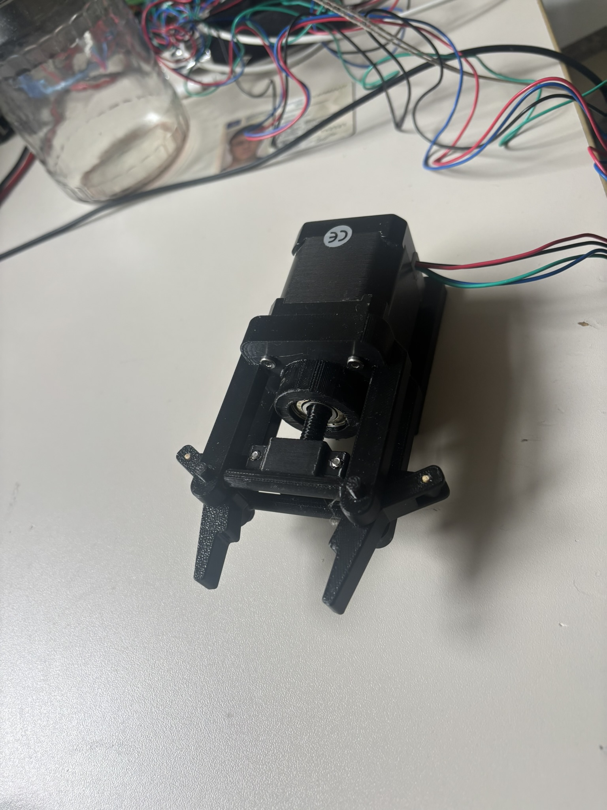
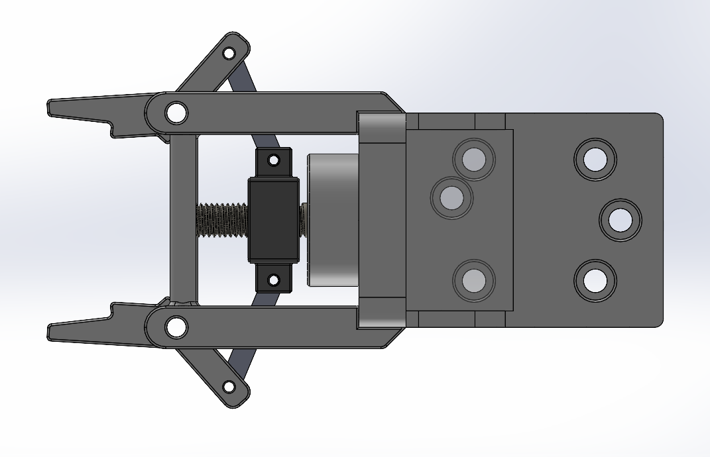
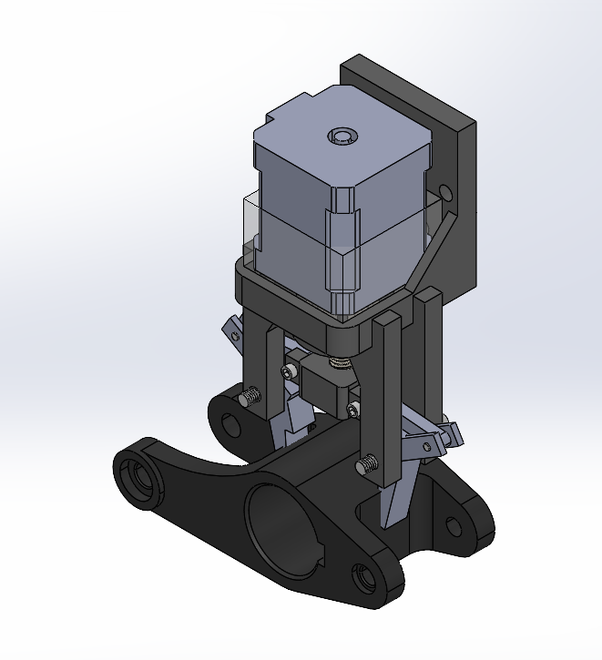
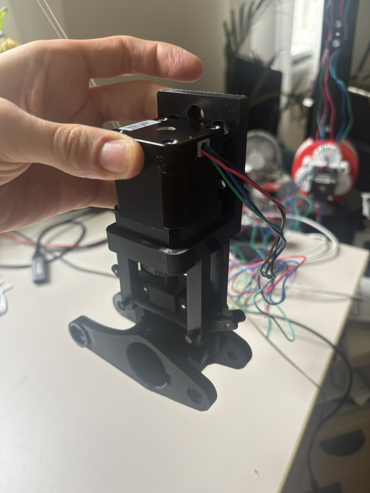

# BroBot - 4-DOF Robot Arm with Cycloidal Gearbox

A DIY 4-axis robot arm driven by stepper motors with cycloidal reduction gears and inverse kinematics control.



BroBot is a DIY robot arm with 4 degrees of freedom (DOF) driven by stepper motors and cycloidal gearboxes. The project includes both the mechanical construction and software control with inverse kinematics for precise TCP positioning (Tool Center Point).

### Specifications

- **Degrees of Freedom:** 4 DOF
- **Base Height to Joint 1:** 150 mm
- **Link Lengths:**
  - L1: 150 mm (Base to Joint 1)
  - L2: 200 mm (Joint 1 to Joint 2)
  - L3: 180 mm (Joint 2 to Joint 3)
  - L4: 120 mm (Joint 3 to TCP)
- **Maximum Reach:** ~500 mm
- **Actuators:** NEMA 17/23 Stepper Motors
- **Gearing:** Cycloidal reduction gears (see exploded view)

## Features

### Hardware
- Cycloidal gearboxes for high reduction ratio and precision
- 3D printed components
- TB6600 stepper motor drivers (up to 4A)
- Arduino-based controller
- Compact design

### Software
- **Inverse Kinematics** - Control via cartesian coordinates (X, Y, Z)
- **Forward Kinematics** - Calculate TCP position from joint angles
- **Python Control Interface** - Command-line interface for easy operation
- **Arduino Firmware** - Real-time stepper motor control
- **Relative & Absolute Movement** - Flexible positioning options
- **Home Position** - Safe reference position

## Hardware

### Components

#### Drive System
- 4x NEMA 17/23 Stepper Motors
- 4x TB6600 Stepper Motor Drivers
- 1x Power Supply 24-36V DC (recommended)
- Arduino Uno/Mega

#### Mechanics
- Cycloidal gearboxes (3D printed)
- Structural parts (3D printed or aluminum)
- Various screws, bearings, and mounting hardware

### TB6600 Stepper Motor Driver

**Specifications:**
- Supply Voltage: 9-40 VDC (optimal: 24-36V)
- Output Current: 0.7-4.0A (adjustable via DIP switches)
- Microstepping Modes: up to 6400 steps/revolution
- Input Signal: 5V (optically isolated)
- Max. Pulse Frequency: 20 kHz

**Connections:**
- **PUL+/PUL-:** Pulse input (Step)
- **DIR+/DIR-:** Direction input
- **ENA+/ENA-:** Enable input
- **A+/A-, B+/B-:** Motor connections

**Important Notes:**
- For 12V control signals: add 1kΩ resistor in series
- For 24V control signals: add 2kΩ resistor in series

### Cycloidal Gearbox

  

The cycloidal gearbox provides:
- High reduction ratios (typically 1:30 to 1:100)
- Very low backlash
- High stiffness
- Compact form factor
- Self-locking at high reduction ratios

## Software

### Architecture

```
┌─────────────────────────────────────┐
│   Python TCP Control Interface      │
│  (Inverse & Forward Kinematics)     │
└────────────────┬────────────────────┘
                 │ Serial (9600 baud)
                 │ Commands: J1:steps, J2:steps...
┌────────────────▼────────────────────┐
│     Arduino Firmware                │
│  (Stepper Control & Positioning)    │
└────────────────┬────────────────────┘
                 │ Step/Dir Signals
┌────────────────▼────────────────────┐
│      TB6600 Stepper Drivers         │
└────────────────┬────────────────────┘
                 │
┌────────────────▼────────────────────┐
│        Stepper Motors               │
└─────────────────────────────────────┘
```

### Calibration - Steps per Degree

The calibration values are based on measured data from the actual system:

| Joint | Steps/90° | Steps/Degree |
|-------|-----------|--------------|
| 1     | 5500      | 61.11        |
| 2     | 8000      | 88.89        |
| 3     | 5000      | 55.56        |
| 4     | 5000      | 55.56        |

## Installation

### Prerequisites

- Python 3.7 or higher
- Arduino IDE
- pySerial library

### Python Setup

```bash
# Clone repository
git clone https://github.com/yourusername/brobot.git
cd brobot

# Create virtual environment (optional)
python -m venv venv
source venv/bin/activate  # Linux/Mac
# or
venv\Scripts\activate  # Windows

# Install dependencies
pip install pyserial
```

### Arduino Setup

1. Open Arduino IDE
2. Load `arudino_inverse_kinematics_automatic_ansteuerung_brobot.ino`
3. Select your board (Arduino Uno/Mega)
4. Select the correct COM port
5. Upload to Arduino

### Configuration

In `python_inverse_kinematics_brobot.py`:

```python
# Adjust serial port
arduino_port = 'COM3'  # Windows
# arduino_port = '/dev/ttyUSB0'  # Linux
# arduino_port = '/dev/tty.usbserial-XXX'  # Mac

# Link lengths (if different from default)
L1 = 150  # mm
L2 = 200  # mm
L3 = 180  # mm
L4 = 120  # mm
```

## Usage

### Starting the Control Interface

```bash
python python_inverse_kinematics_brobot.py
```

### Initialization

At startup, you'll be prompted to enter the current joint angles:

```
Please enter current joint angles (in degrees):
  Joint 1: 0
  Joint 2: 45
  Joint 3: 90
  Joint 4: -45
```

### Commands

#### Absolute Positioning
```bash
TCP> goto 300 100 200
# Moves TCP to position X=300mm, Y=100mm, Z=200mm
```

#### Relative Movement
```bash
TCP> up 10        # Move 10mm upward
TCP> down 5       # Move 5mm downward
TCP> forward 20   # Move 20mm forward
TCP> back 15      # Move 15mm backward
TCP> left 10      # Move 10mm to the left
TCP> right 10     # Move 10mm to the right
```

#### Other Commands
```bash
TCP> status       # Show current position and angles
TCP> home         # Move to home position
TCP> stop         # Stop all movements
TCP> help         # Show all commands
TCP> exit         # Exit program
```

### Example Session

```bash
TCP> goto 400 0 150
Moving TCP to position: X=400.0, Y=0.0, Z=150.0
Calculated joint angles:
  Joint 1: 0.0°
  Joint 2: 45.2°
  Joint 3: 67.8°
  Joint 4: -23.0°
→ Joint 1: 0.0° (0 Steps)
→ Joint 2: 45.2° (4018 Steps)
→ Joint 3: 67.8° (3767 Steps)
→ Joint 4: -23.0° (-1278 Steps)

TCP> up 50
[...]

TCP> status
============================================================
ROBOT STATUS
============================================================
TCP Position: X=400.0, Y=0.0, Z=200.0 mm

Joint Angles:
  Joint 1: 0.0°
  Joint 2: 52.3°
  Joint 3: 71.2°
  Joint 4: -33.5°
============================================================
```

## Kinematics

### Inverse Kinematics

The inverse kinematics algorithm calculates the required joint angles for a desired TCP position:

**Coordinate System:**
- X: Forward/Backward
- Y: Left/Right
- Z: Up/Down

**Solution Approach:**
1. Joint 1 (Base): `θ₁ = atan2(y, x)`
2. Reduce to 2D problem in the XZ plane
3. Calculate Joint 2 & 3 using the law of cosines
4. Joint 4: Compensate to keep end-effector horizontal

**Workspace Limits:**
- Maximum reach: L2 + L3 + L4 = 500 mm
- Minimum reach: |L2 - L3 - L4| (depends on configuration)

### Forward Kinematics

Calculates the TCP position from given joint angles:

```
x_tcp = (L2·cos(θ₂) + L3·cos(θ₂+θ₃) + L4·cos(θ₂+θ₃+θ₄)) · cos(θ₁)
y_tcp = (L2·cos(θ₂) + L3·cos(θ₂+θ₃) + L4·cos(θ₂+θ₃+θ₄)) · sin(θ₁)
z_tcp = L1 + L2·sin(θ₂) + L3·sin(θ₂+θ₃) + L4·sin(θ₂+θ₃+θ₄)
```

### Working Position


## End-Effector: Parallel Gripper with Toggle Mechanism





A motorized parallel gripper designed as an end-effector for the BroBot. The gripper uses a NEMA 17 stepper motor driven by the same TB6600 drivers as the robot joints.
Key Features

### Toggle Mechanism: Employs a knee-lever mechanism for mechanical advantage, dramatically amplifying gripping force as the jaws close
Same Hardware: Uses NEMA 17 motor and TB6600 driver (compatible with existing BroBot electronics)
Parallel Jaws: Ensures even pressure distribution across gripping surfaces
Compact Design: Lightweight and suitable for mounting on Joint 4/TCP



### Toggle Mechanism Principle
The gripper uses a toggle (knee-lever) mechanism that provides increasing mechanical advantage as the jaws approach the closed position. This allows high clamping forces with minimal motor torque and enables the gripper to maintain grip even when not actively powered.
Integration
The gripper connects mechanically to the BroBot's TCP and electrically to an additional TB6600 driver. Control is integrated into the existing Arduino/Python interface as an additional "Joint 5" for simple open/close commands.





### Components
1x NEMA 17 Stepper Motor
1x TB6600 Driver
3D printed gripper jaws and toggle linkages
Various bearings and fasteners

## Troubleshooting

### Common Issues

**Issue: "Position not reachable!"**
- Solution: Check if the target position is within the workspace
- Maximum reach: ~500mm from origin

**Issue: Motors not moving**
- Check wiring to TB6600 drivers
- Check power supply (minimum 9V)
- Check enable signal
- Verify DIP switch settings on TB6600

**Issue: Steps are being lost**
- Reduce speed (increase delay in Arduino code)
- Check current setting on TB6600
- Check for mechanical friction or binding

**Issue: Serial connection fails**
- Verify COM port in `python_inverse_kinematics_brobot.py`
- Check if Arduino is connected
- Close Arduino IDE Serial Monitor if open


